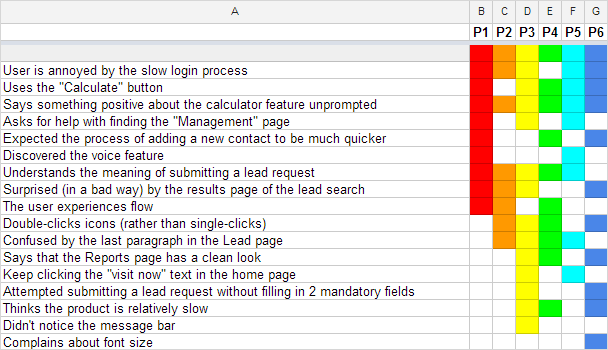

# Figma Workshop 2

## What will we be doing in this session?

You spend the first 75 minutes of the session iterating over your Figma prototype using the feedback from the PO's

For the remaining 45 minutes you will create a usability testing script for the Product owner to use the following week.

## Why test?

- Get feedback quickly
- See how someone unfamiliar with the idea interacts with a app
- Understand which features to prioritise
- Adapt the content and copy

## Things to consider when creating a script

**Start with an introduction**

_"Thanks for helping us today. My name is Belinda, I’m a developer. The app we’re working on is…"_

**Explain the process**

_"Don’t worry about making mistakes, it all helps us understand how you, as the user thinks"_

_"Be honest, you’re not going to hurt our feelings and any negative feedback helps us improve the idea"_

_"Ask any questions you have throughout but I might not answer them until the end"_

_"We'll be recording the screen/taking notes"_

**Asking questions**

Start with general questions:

- How do you feel about shopping online? How often do you shop online?
- How much do you use your phone vs a laptop when on the internet?

**Tasks**

Giving your user some tasks to complete can help you to see how they use your app. This will also be useful when you complete Traffic Light and Rainbow analysis.

_For example:_

_Could you create a profile?_
_Where might you look for help?_
_How would you book an appointment?_

**Closing off**

Ask a few questions to wrap up the session:

How was your overall experience moving around the app?
What else would you like it to do?
Anything else you feel we should know?

- Add in information about the two types of analysis, so that they can ask questions that help them analyse their feedback better.

## Traffic light & Rainbow analysis

To help you think about the kinds of questions to ask your users when creating your scripts it is important to understand the analysis process looks.

**Traffic light analysis**

During this analysis you create a spreadsheet or table with tasks you asked the users to complete as rows; and participants as columns. You can then mark whether the user:

- Completed the task
- Struggled with the task
- Did not complete the task

_It should look like this_

**Rainbow Analysis**

During this analysis you create a spreadsheet and list observations in rows, and participants in columns. Where an observation occurs, mark the cell, giving each participant a different colour.

_It should look like this_
