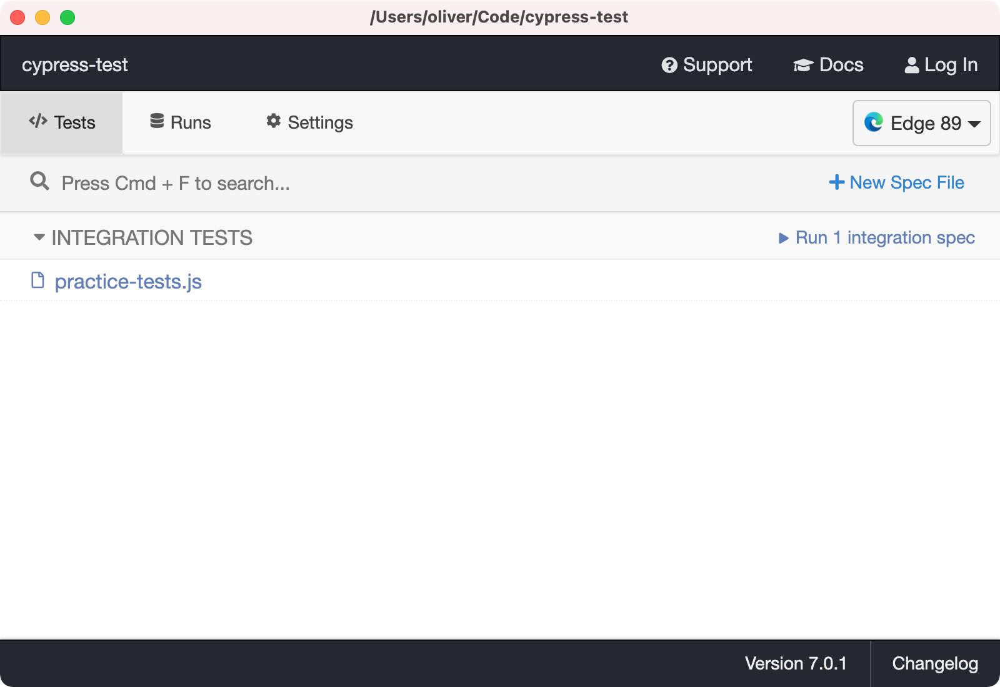
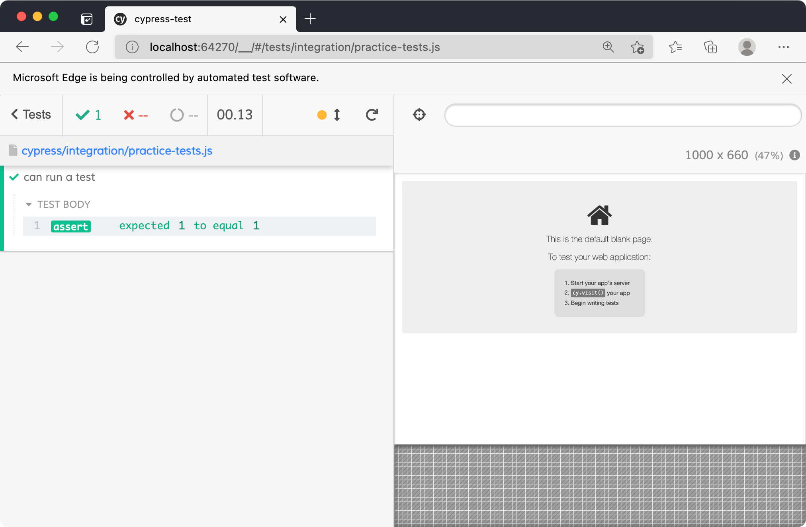
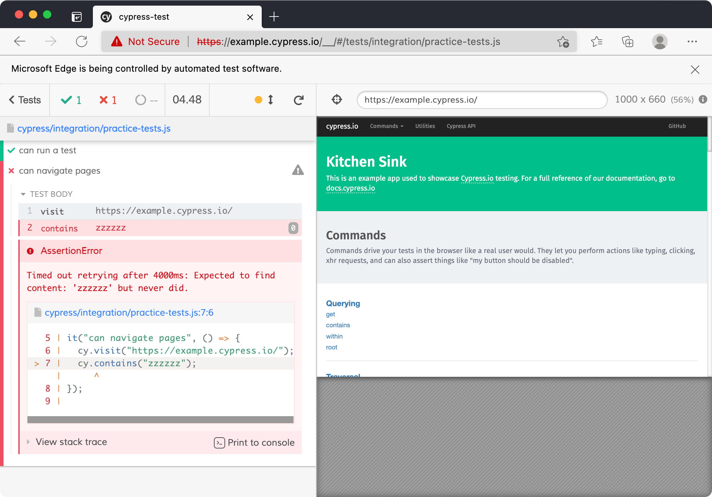

Cypress is a tool for automatically running your tests in a real web browser. Lots of testing libraries run using Node in your terminal. This means they struggle to test real user interactions with the DOM (since Node doesn't have one).

You can test in the browser by manually including test functions in a script tag on the page. However this isn't ideal as you have to remember to remove them from your production deployment (or all your users can see your test results in the console).

Cypress solves this problem by letting you write separate test files, then injecting them into a real browser. Since it automatically controls a browser you can see your tests running in in real time.

## Setup

First we need to create a new directory and initialise it so we can install modules:

```shell
mkdir cypress-intro
cd cypress-intro
npm init -y
```

Once you're inside your new directory and have generated a `package.json` file you can install Cypress as a dev dependency:

```shell
npm install -D cypress
```

Cypress can take a while to install the first time, so be patient. Once it's finished open your `package.json` and edit the `"test"` script to this command:

```json
{
  "scripts": {
    "test": "cypress open"
  }
}
```

Run `npm run test` in your terminal, and you should see the Cypress app start up. The window will show a bunch of example tests—don't worry about these for now.

The first time you run Cypress it automatically creates some files. You should see a `cypress.json` file and a `cypress/` directory full of examples. The JSON file is used to configure Cypress—you can leave it empty for now.

Now you're ready to write your first test.

## Your first Cypress test

By default Cypress looks in the `cypress/integration/` directory for test files. It will run anything inside this folder. You can delete the auto-generated `example/` folder, since we're going to start from scratch.

Create a new file called `practice-tests.js`. You should see this file show up in the Cypress app under "Integration tests".

<figure>
  
  <figcaption>The Cypress app showing a single test</figcaption>
</figure>

You can click the file name to run it with Cypress. This should open up a browser with a "test sidebar" on the left. Since we didn't actually write any tests yet it'll say "No tests found".

Let's add a simple test to the file:

```js
it("can run a test", () => {
  assert.equal(1, 1);
});
```

Cypress uses a global `it` function to define tests. This works just like the `test` function we wrote in the [intro to testing](/workshops/learn-testing/) workshop—it just has a different name.

If you save your test file Cypress should automatically re-run the test. It will now find the test and show the result in the sidebar.

<figure>
  
  <figcaption>My browser running our first test</figcaption>
</figure>

This is a fine way to write simple unit tests, but Cypress is much more powerful. Let's test a real web page.

Add a new test function:

```js
it("can navigate pages", () => {
  cy.visit("https://example.cypress.io/");
});
```

We're using the global `cy` object to run a "command". `cy.visit` tells Cypress to load a URL in the browser and wait for the page to load.

You should see the test re-run in your Cypress browser. The right side should load Cypress' example app (called "Kitchen Sink").

Let's add a command to find an element on the page:

```js
it("can navigate pages", () => {
  cy.visit("https://example.cypress.io/");
  cy.contains("within");
});
```

`cy.contains` will search the text content of all elements until it finds a match. If you click this test in the sidebar you should see the "Test body" table. Hover the `contains` command and the browser on the right will update to highlight the element it found.

If a Cypress command _fails_ it will cause the test to fail. For example change your test to search for an element containing `"zzzzzz"`. You should see an error message in the sidebar.

<figure>
  
  <figcaption>A failed test in the sidebar</figcaption>
</figure>

Now let's interact with this element in our test:

```js
it("can navigate pages", () => {
  cy.visit("https://example.cypress.io/");
  cy.contains("within").click();
});
```

This will tell Cypress to click the link. You should see the test re-run, and the browser navigate to the "Querying" page.

Finally we can make an assertion about the new page to verify that we got to the right place:

```js
it("can navigate pages", () => {
  cy.visit("https://example.cypress.io/");
  cy.contains("within").click();
  cy.url().should("include", "/commands/querying");
});
```

This syntax is a little strange at first, but it's supposed to read like a sentence. The `cy.url` method retrieves the current URL. The `.should` method creates an assertion. Here we are checking that the URL includes the sub-string "/commands/querying".

That's it—we've created a full integration test with Cypress. It's important to note that we aren't limited to a single set of tasks in a test. We can keep adding more commands in here until we're satisfied.

## Cypress commands

You can find a full set of available commands at https://example.cypress.io/. Here's a quick example with a few new ones that will useful:

```js
cy.get("#signup-form").find("input[name='email']").type("my-email@test.com");
cy.get("#signup-form").submit();
```

Here we're getting the sign up form, finding the email input within it, then typing an email into that input. Finally we get the form again and submit it.

`cy.get` takes a CSS selector to find an element, just like `querySelector` in the DOM. `.find` works the same way, but it searches the _children_ of an element. `.type` simulates typing text via the keyboard. `.submit` triggers a form submission.



**Note**: normal `console.log`s won't show up in the Cypress sidebar. The easiest way to debug things is to use the [`cy.log`](https://docs.cypress.io/api/commands/log) command.



## Workshop

You're going to use Cypress to build a server TDD-style. That means write a failing test for each feature first, then implement that feature to make the test pass.

### Quick setup

1. Create a `server.js` file
1. `npm install express`
1. `npm install -D nodemon` (for auto-restarting the server)
1. Add a "dev" npm script of: `nodemon server.js`

Write your Express server in `server.js`. Write your tests in `cypress/integration/`.



**Note**: make sure your server is running before you start Cypress, otherwise it won't be able to find the localhost address.



### Requirements for your server

- `/` page with a title of "Welcome to my site"
- `/` page has working links to `/about` and `/sign-up`
- `/about` page with a title of "About this site"
- `/sign-up` page with a form containing email/password inputs
- `/welcome` page with a title of "Thanks for joining"
- `/sign-up` page redirects to `/welcome` after form submission (don't worry about actually using the submitted data)

### Stretch goal

If you have spare time go back to the [server-side forms workshop](/workshops/server-side-forms/). Use Cypress to write tests for your solution to verify that it works correctly
