An exercise to practice git workflow skills. The workshop should be undertaken by two programmers, working on two computers.

**Note**: you may see references to a `master` branch in diagrams or external resources. This used to be the name of the default Git branch, but this was changed to `main` last year. New repos should all have a `main` branch, so that's what you should use.

## Part 1: Initial setup

You're working in a team of two on a project for a new client. Steps 1 to 8 in this section should be completed by one of you, who we'll refer to as `Programmer 1`.

### Step 1: make a new repo

Programmer 1 creates a new GitHub repo and clones it.

<!-- 1. Go to your cohort's GitHub organisation and create a new repo, initialising it with a `README.md`. -->

1. Create a new GitHub repo on Programmer 1's profile
1. Go to "Settings > Collaborators" and add Programmer 2 so they can access the repo
1. Clone this new repository using your terminal.
   ```shell
   git clone 'PASTE THE URL OF YOUR REPOSITORY HERE'
   ```
1. Move into the newly created directory.
   ```shell
   cd your-repo-name-here
   ```
   This is what your remote and local repositories look like after this. HEAD is a reference to your current location.</br>

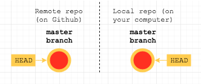

### Step 2: raise issues

Normally you would decide on which "features" you were going to build and then break these down into smaller tasks before starting the work. These tasks can be tracked with GitHub issues.

For the sake of this exercise, we're just going to [add one issue](https://help.github.com/articles/creating-an-issue/) at the moment. Your client wants a beautifully styled heading for the homepage. It should be bold black writing with a background shadow that makes it stand out.

1. Raise a new issue with a descriptive title.
1. In the body of the issue, provide more detail about how to complete the work.
1. Assign yourselves to this issue.

### Step 3: move to a new branch

There are many types of workflow. At FAC we use [GitHub flow](https://guides.github.com/introduction/flow/), where the `main` branch is always deployable. In this flow, each branch is used for a separate feature.

1. Create a branch with a unique and descriptive name. For example, `create-heading-with-shadow`.
   ```shell
   git branch create-heading-with-shadow
   ```
   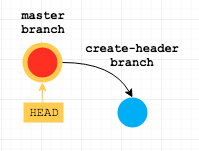
1. Leave the main branch by switching to the new branch you have just created.
   ```shell
   git checkout create-heading-with-shadow
   ```
   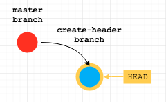

Alternatively you can do this in a single step by using the `-b` flag to tell the `git checkout` command to create the new branch:

```shell
git checkout -b create-heading-with-shadow
```

### Step 4: satisfy the requirements

Now we need to write some code to add the new feature.

1. Add the following code into a new file called `index.html`.

   ```html
   <!DOCTYPE html>
   <html lang="en">
     <head>
       <meta charset="UTF-8" />
       <meta name="viewport" content="width=device-width, initial-scale=1.0" />
       <link rel="stylesheet" href="style.css" />
       <title>Git Workflow Workshop</title>
     </head>

     <body>
       <h1 class="some-heading">GIT WORKFLOW WORKSHOW</h1>
     </body>
   </html>
   ```

   **Note**: you may notice errors in this code. This is deliberate—we'll be fixing them later on in the workshop.

1. Create a new file called `style.css` which contains:

   ```css
   * {
     margin: 0;
     padding: 0;
   }

   .page-heading {
     box-sizing: border-box;
     font-family: "Avant Garde", Avantgarde, "Century Gothic", CenturyGothic,
       "AppleGothic", sans-serif;
     font-size: 3.5rem;
     padding: 5rem 3rem;
     text-align: center;
     text-rendering: optimizeLegibility;
     color: #131313;
     background-color: #e7e5e4;
     letter-spacing: 0.15em;
     text-shadow: 1px -1px 0 #767676, -1px 2px 1px #737272, -2px 4px 1px #767474,
       -3px 6px 1px #787777, -4px 8px 1px #7b7a7a, -5px 10px 1px #7f7d7d,
       -6px 12px 1px #828181, -7px 14px 1px #868585, -8px 16px 1px #8b8a89, -9px
         18px 1px #8f8e8d, -10px 20px 1px #949392, -11px 22px 1px #999897,
       -12px 24px 1px #9e9c9c, -13px 26px 1px #a3a1a1, -14px 28px 1px #a8a6a6, -15px
         30px 1px #adabab, -16px 32px 1px #b2b1b0, -17px 34px 1px #b7b6b5,
       -18px 36px 1px #bcbbba, -19px 38px 1px #c1bfbf, -20px 40px 1px #c6c4c4, -21px
         42px 1px #cbc9c8, -22px 44px 1px #cfcdcd, -23px 46px 1px #d4d2d1,
       -24px 48px 1px #d8d6d5, -25px 50px 1px #dbdad9, -26px 52px 1px #dfdddc, -27px
         54px 1px #e2e0df, -28px 56px 1px #e4e3e2;
   }
   ```

### Step 5: stage your changes

1. Add `index.html` and `style.css` to the [staging area](http://softwareengineering.stackexchange.com/questions/119782/what-does-stage-mean-in-git).

```shell
git add index.html style.css
```

If you know you definitely want to stage _all_ your current changes you can save some typing and use:

```shell
git add .
```

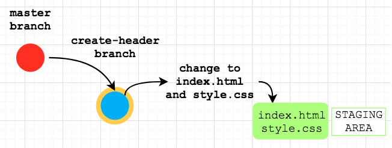

### Step 6: commit your changes

The history of a project is made up of ["commits"](https://stackoverflow.com/questions/2745076/what-are-the-differences-between-git-commit-and-git-push). Each commit is a snapshot of your whole repository at one particular time.

The message you type to describe each commit is important, since it will be preserved in the history of the project for future contributors. It should be descriptive and relatively high-level—someone can always read the code to find out specifically what you changed.

For example this message is not descriptive enough: "update title". This one is a bit _too_ descriptive: "Use an h1 element with a classname applying nice text shadow CSS". This one has a good balance: "Add new page heading element with styles".

Here are some [great guidelines](https://chris.beams.io/posts/git-commit/) on writing better, more useful commit messages.

It's also important to link your code changes to the issues that track them. GitHub lets you use a hash symbol followed by a number to [connect a commit to an issue](https://help.github.com/articles/autolinked-references-and-urls/). For example if the message includes `Relates #1` it will show this commit in issue number 1 on the GitHub repo. If a commit totally _fixes_ an issue you can use `Closes #1`, and GitHub will automatically close the issue when the commit is pushed to GitHub.

1. Commit the files that are in the staging area.
   ```shell
   git commit -m 'Add new page heading element with styles' -m 'Relates #1'
   ```
   Here we're using a second `-m` flag to add another line to our commit message with the extra issue info.
   You could also just run `git commit`, which will open your [default text editor](https://oliverjam.es/blog/make-your-terminal-nicer/#set-your-default-editor) so you can write longer commit messages in a more comfortable environment.

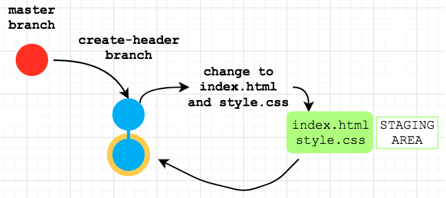

### Step 7: push your changes to GitHub

At this point your remote repo on GitHub hasn't changed yet. You need to push your changes.

1. Push the `create-heading-with-shadow` branch up to the "origin" (the GitHub repo that you cloned from).
   ```shell
   git push origin create-heading-with-shadow
   ```

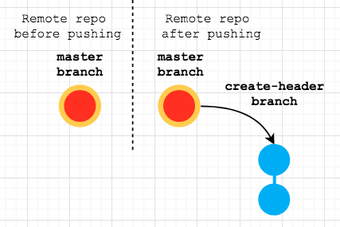

### Step 8: create a pull request

1. Programmer 1 navigates to the repository on GitHub and creates a pull request.
   - Add a descriptive title (e.g. `Create page heading`)
   - Add some more info about the change in the body. You can also link the PR to the issue here by including `Relates #1` or `Closes #1`.
   - Select Programmer 2 as an [assignee](https://help.github.com/articles/assigning-issues-and-pull-requests-to-other-github-users/).

### Step 9: merge the pull request

You usually shouldn't merge your own pull requests. A PR gives the rest of your team the chance to review before your changes are merged into `main`. In your projects, you will be asking the other pair to do this.

1. Programmer 2 reviews the changes.
   This is where you'd leave any feedback or request changes to be made.
1. Programmer 2 merges the pull request

Now your remote repo looks like this:

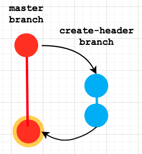

You can go and close the issue tracking this feature now that the change is merged (If you put `Closes #1` in your commit message it will have automatically closed).

---

## Part 2: splitting the work

Your quality assurance engineer has just noticed some problems with the recent change to the website.

1. Spelling mistake in the heading (the word 'WORKSHOW' should be replaced with 'WORKSHOP')
1. The classname applied to the `h1` is wrong, so the styles aren't applying (`class="some-heading"` should be replaced with `class="page-heading"`).

<figure>
   
   <figcaption>The current heading</figcaption>
</figure>

<figure>
   
   <figcaption>How the heading should look</figcaption>
</figure>

**Programmer 1 will fix the first problem** and **Programmer 2 will fix the second**. When you begin working on your weekly projects, you will always be pairing. So Programmer 1 represents "pair 1" and Programmer 2 represents "pair 2". From this point on you both need to work on separate computers.

**Note: Only one line in the `index.html` file needs to be modified.**

### Step 1: clone the repo (Programmer 2)

1. Programmer 2 also needs a copy of the repo, since they haven't worked on it yet
   ```shell
   git clone 'PASTE THE URL OF YOUR REPOSITORY HERE'
   ```

### Step 2: raise 2 new issues

1. Create the following two issues and assign each one to a different person
   - `Fix typo in page heading` (Programmer 1)
   - `Correct the classname of page heading` (Programmer 2)

### Step 3: create your branches

Git branches are used to make sure each person can work independently without affecting the code others in the team are working on.

1. Both programmers create one branch each:
   - `git checkout -b fix-typo-heading` (Programmer 1)
   - `git checkout -b update-class-heading` (Programmer 2).

### Step 4: make your changes

It's important to avoid making unrelated changes as you work. It can be tempting to just quickly fix an error if you spot one while doing some other work. However this makes the Git history of changes really difficult to track. It's also confusing to review a pull request that has lots of unrelated changes.

1. Programmer 1 fixes **only the spelling typo** in the heading (WORKSHOW -> WORKSHOP).
   ```html
   <h1 class="some-heading">GIT WORKFLOW WORKSHOP</h1>
   ```
1. Programmer 2 updates **only the class name** of the heading (`class="some-heading"` -> `class="page-heading"`).
   ```html
   <h1 class="page-heading">GIT WORKFLOW WORKSHOW</h1>
   ```

### Step 5: stage your changes

1. Both programmers save their `index.html` files.
1. Both programmers check the status of their files, to confirm that `index.html` has been modified.
   ```shell
   git status
   ```
1. Both programmers add their modified `index.html` file to the staging area.
   ```shell
   git add index.html
   ```

### Step 6: commit your changes

1. Both programmers commit their change. Don't forget the multi-line commit message with the referenced issue.

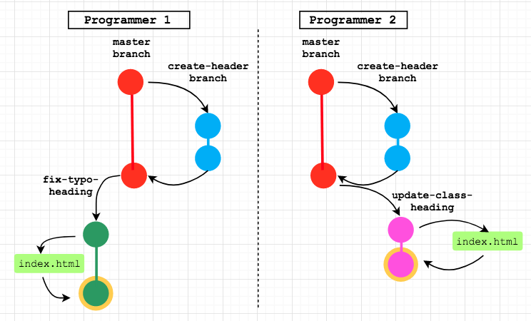

**Important: don't work in parallel from here**. We want to push, PR and merge Programmer 1's change first, _then_ move on to Programmer 2's change.

### Step 7: pull any new changes (Programmer 1)

On a real project there might be lots of other people contributing code simultaneously. It's a good idea to regularly incorporate changes from the remote `main` branch into your branch (especially if you've been working on this branch for a long time). You usually want to check for remote changes before pushing your branch.

1. Programmer 1 switches to `main` branch.
   ```shell
   git checkout main
   ```
1. Programmer 1 pulls any changes from the `main` branch of the remote (GitHub repo). There should be no changes since neither of you has pushed any changes yet.
   ```shell
   git pull origin main
   ```
   On the default branch you can use a shorthand, since Git knows which remote branch to use:
   ```shell
   git pull
   ```
1. Programmer 1 switches back to the `fix-typo-heading` branch.
   ```shell
   git checkout fix-typo-heading
   ```
   Since there were no new changes to deal with Programmer 1 can move on to pushing.

### Step 8: push changes (Programmer 1)

1. Programmer 1 pushes their `fix-typo-heading` branch to remote
   ```shell
   git push origin fix-typo-heading
   ```

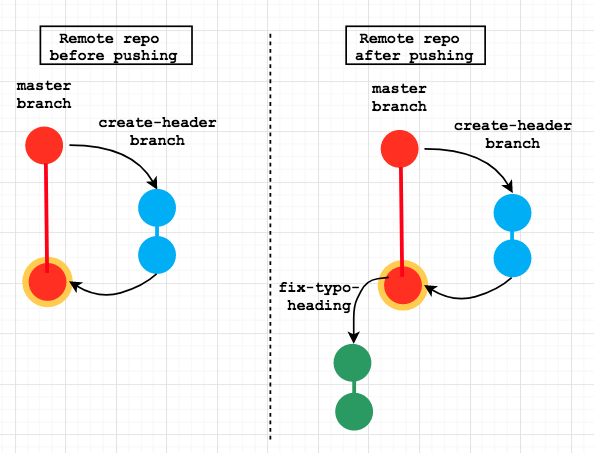

### Step 9: create a pull request (Programmer 1)

1. Programmer 1 creates a pull request.
   - Don't forget a descriptive title/body (and link the relevant issue in the body)
   - Assign Programmer 2 to review

### Step 10: review the pull request (Programmer 2)

1. Programmer 2 reviews the pull request
   1. Step through each commit (in this case one)
   1. Check the "Files changed" tab for a line-by-line breakdown.
   1. Click "Review changes" and choose from "Comment", "Approve" or "Request changes"

### Step 11: merge the pull request (Programmer 2)

1. Programmer 2 merges the pull request

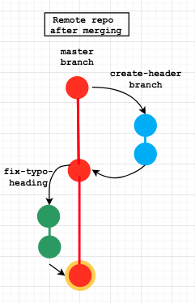

**Note: now Programmer 1's changes are merged we can move on to Programmer 2's**

### Step 12: pull any new changes (Programmer 2)

Remember it's always a good idea to check for any new changes on the remote before pushing your branch. In this case we know that Programmer 1's branch was just merged, so there _will_ be changes. Once we've pulled them to the local `main` branch we'll need to _merge_ them into the `update-class-heading` branch.

1. Programmer 2 switches to `main` branch.
   ```shell
   git checkout main
   ```
1. Programmer 2 pulls the remote `main` branch
   ```shell
   git pull
   ```
   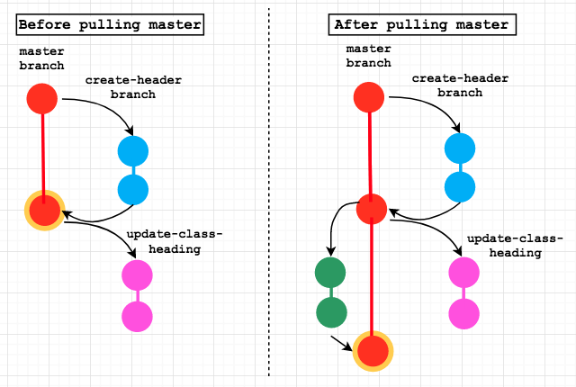
1. Programmer 2 switches back to the `update-class-heading` branch.
   ```shell
   git checkout update-class-heading
   ```
1. Programmer 2 tries to merge `main` branch into `update-class-heading` branch.

   ```shell
   git merge main
   ```

   At this point there should be a "merge conflict". Move on to the next section to find out how to resolve this.

### Step 13: resolve merge conflicts (Programmer 2)

This conflict occurred because the line with the `<h1>` heading was changed by Programmer 1 _and_ Programmer 2. Git doesn't know how to merge the two different versions of this line together, so it needs you to do it manually. Merge conflicts are [highlighted with HEAD and main markers](http://stackoverflow.com/questions/7901864/git-conflict-markers) like this:

```html
<body>
  <<<<<<< HEAD
  <h1 class="page-heading">GIT WORKFLOW WORKSHOW</h1>
  =======
  <h1 class="some-heading">GIT WORKFLOW WORKSHOP</h1>
  >>>>>>> main
</body>
```

The code between `<<<<<<< HEAD` and `======` is the current change on this branch. The code between the `======` and `>>>>>>> main` is the change from the `main` branch that we are merging in.

You can resolve the conflict by manually editing the code to leave only the change you expect. You can also use VS Code's built-in options to choose either the `HEAD` or `main` change (or both). You also need to make sure to remove the conflict marker lines, since those are not valid HTML code. Finally you need to make a new commit for the merge.

1. Programmer 2 removes HEAD and main markers
1. Programmer 2 manually merges the two different `h1` lines to keep both new changes
   ```html
   <body>
     <h1 class="page-heading">GIT WORKFLOW WORKSHOP</h1>
   </body>
   ```
1. Programmer 2 adds the `index.html` file to staging area and commits the merge changes.

```shell
git add index.html
git commit -m 'Merge main and resolve conflicts'
```

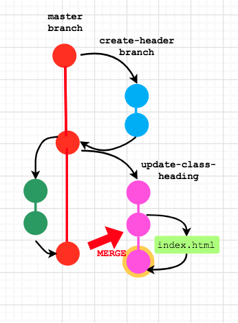

### Step 14: push your changes (Programmer 2)

1. Programmer 2 pushes the `update-class-heading` branch to remote.

```shell
  git push origin update-class-heading
```

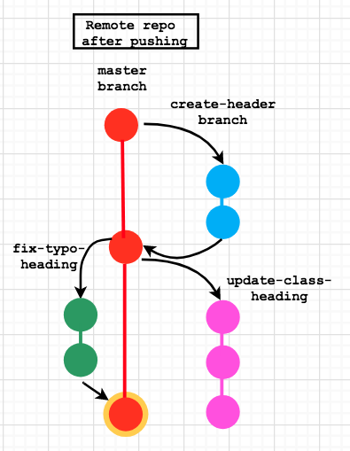

### Step 15: create a pull request (Programmer 2)

1. Programmer 2 creates a pull request.
   - Don't forget a descriptive title/body (and link the relevant issue in the body)
   - Assign Programmer 1 to review

### Step 16: review the pull request (Programmer 1)

1. Programmer 1 reviews the pull request
   1. Step through each commit (in this case one)
   1. Check the "Files changed" tab for a line-by-line breakdown.
   1. Click "Review changes" and choose from "Comment", "Approve" or "Request changes"

### Step 17: merge the pull request (Programmer 1)

1. Programmer 1 merges the pull request

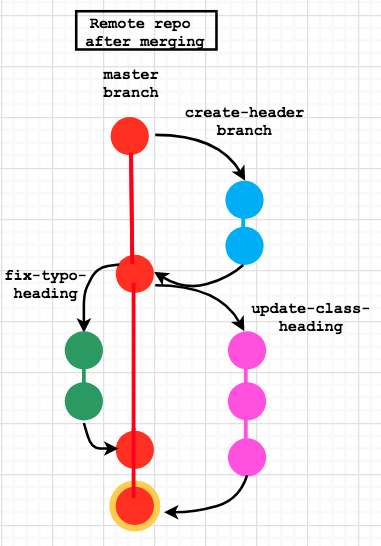

## Finishing up

That's it, you have successfully followed the GitHub flow to add a new feature and fix some bugs.

Both Programmer 1 and Programmer 2 can switch back to the `main` branch and pull the remote changes. They should also both delete their other local branches since they are now merged. The final step should be to close any open issues (if the PRs didn't do this automatically).
