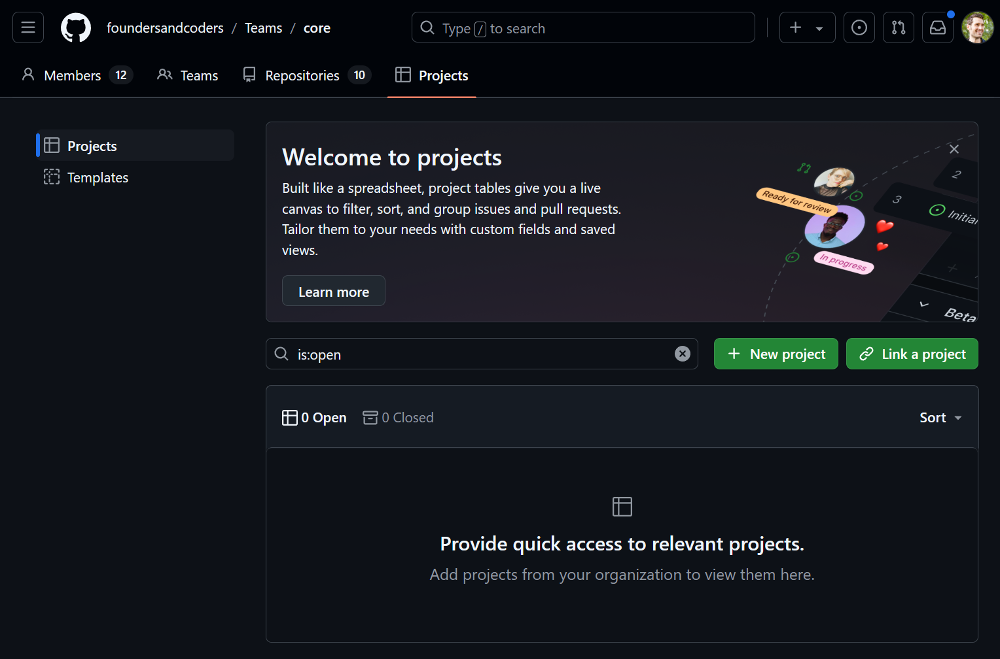
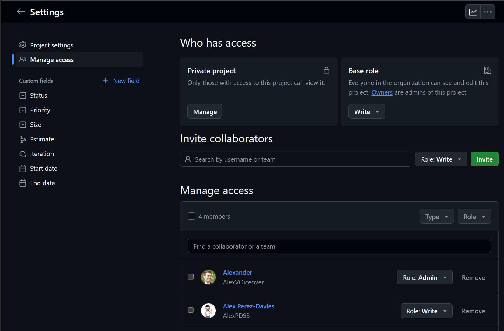
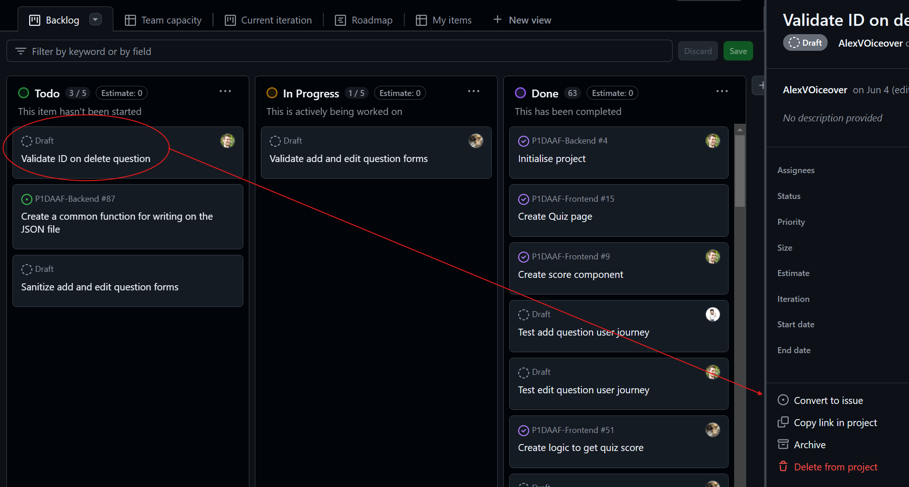
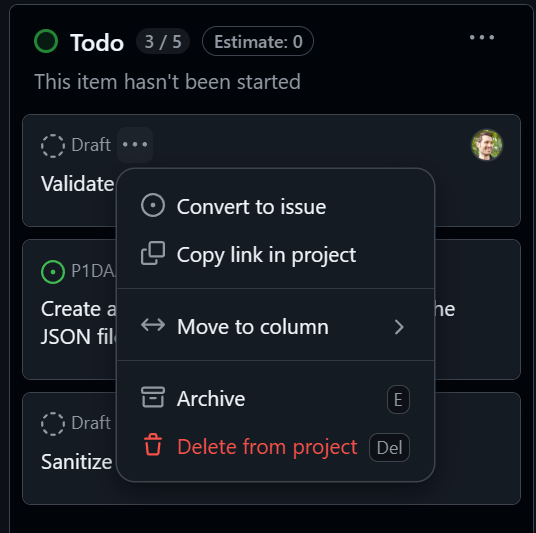
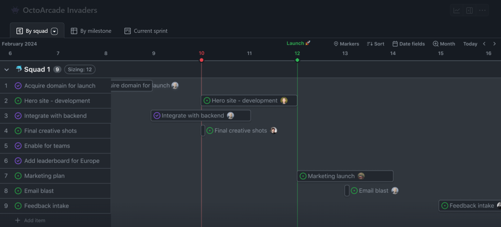
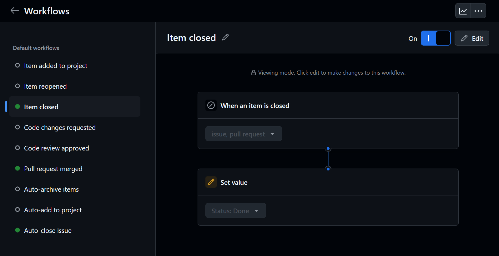

# GitHub Projects Workflow Workshop

This workshop will guide you through the process of setting up and using GitHub Projects for effective project management and collaboration. You'll learn how to create a project, add tasks, link them to issues, and use different views to track progress.

## Part 1: Understanding GitHub Projects

### Step 1: What is GitHub Projects?

Despite its name, GitHub Projects is not tied to a single repository. It's a project management tool that can be used across multiple repositories or even without any repository at all.

1. GitHub Projects is a flexible tool for planning and tracking work.
2. It can be used for various purposes, from software development to event planning.
3. Projects are not automatically tied to repositories when created.

### Step 2: Creating a GitHub Project

1. Go to your GitHub profile or organization.
2. Click on "Projects" in the top navigation bar.
3. Click "New project".
4. Choose a template or start from scratch.
5. Give your project a name and description.

### Step 3: Managing Access

Like repositories, GitHub Projects can be public or private, and you need to manage access to them.

1. Go to your newly created project.
2. Click on the three dots (...) menu in the top right corner.
3. Select "Settings".
4. Go to "Manage access".
5. Add collaborators as needed.

## Part 2: Working with GitHub Projects

### Step 1: Exploring Different Views

GitHub Projects offers different views to help you visualize your work:

1. Board view: A Kanban-style board for task management.
2. Table view: A spreadsheet-like view for detailed tracking.
3. Roadmap view: A Gantt chart for timeline visualization.

Let's explore each of these:

1. In your project, click on the dropdown next to the current view name (likely "Board").
2. Select each view and observe how the information is presented differently.

### Step 2: Creating Tasks (Tickets)

In the Board view:

1. Click the "+ Add item" button at the bottom of a column.
2. Type a title for your task.
3. Press Enter to create the task.

### Step 3: Converting Tasks to Issues

Converting a task to an issue allows for better traceability and automation.

#### Method 1: From the task detail
  1. Click on a task to open its details.
  2. Click on the "Convert to issue" button.
  3. Select the repository where you want to create the issue.
  4. Click "Create issue".

#### Method 2: Using the three dots menu
  1. Click on the three dots (...) menu next to the task.
  2. Select "Convert to issue" from the dropdown menu.

### Step 4: Assigning Tasks

1. Click on a task to open its details.
2. In the sidebar, click on "Assignees".
3. Select the team member you want to assign the task to.

### Step 5: Using the Roadmap View

The Roadmap view helps in setting deadlines and visualizing the project timeline.

1. Switch to the Roadmap view.
2. Click and drag on a task to set its start and end dates.
3. Observe how tasks are arranged on the timeline.

## Part 3: Integrating with Repositories

### Step 1: Linking a Project to a Repository

1. Go to your repository on GitHub.
2. Click on the "Projects" tab.
3. Click "Link a project".
4. Select your project from the list.

Repeat these steps for each repository you want to link to the project. This allows you to:

- Track issues and pull requests from multiple repositories in one place
- Create cross-repository dependencies
- Get a holistic view of your entire project, even when the code is distributed across different repositories

Remember, you can link as many repositories as needed to a single project, making it easier to manage large, multi-component software projects.

### Step 2: Automating Workflows

GitHub Projects can automate certain tasks based on repository activity.

1. In your project, go to "Settings" > "Workflows".
2. Click "New workflow".
3. Set up a rule, for example: "When an issue is closed, set its status to Done" (Note: This workflow may already exist by default in some project templates).

