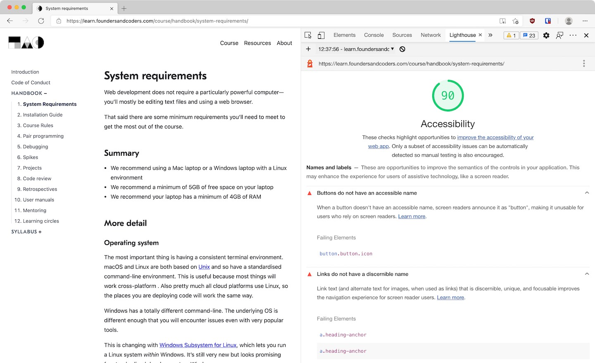

It's important to remember that the web is for everybody. You should strive to build interfaces that are _accessible_ to as many people as possible. This means specifically including users who often get left out: those with disabilities.

As developers we have both a moral and legal imperative to make sure our applications are accessible. A UI that can only be used by a sighted person with a mouse should be considered _broken_, just like a UI that _isn't_ usable with a mouse would be considered broken.

This workshop will cover some of the ways disabled users browse the web, how to design/develop to meet those needs, and how to test your code to make sure that it does.

## Key points

- Don't make assumptions about how people will use your site
- Strive to make your UI usable by everyone
- Get out of your comfort zone when testing your UI

## Common problems

It's easy for developers to forget that people using their apps aren't necessarily like them. This can include both permanent disabilities, temporary disabilities, and even unavoidable technical limitations.

Here are some examples:

- A colorblind user cannot perceive the difference between certain colours. If you use only colour to indicate what a button does they won't be able to use it.

- A blind user cannot see your UI, and may use screen reader software to have the elements on the page read out loud by their computer. If you _only_ communicate important information visually (e.g. using images) they won't hear it.

- A user with a broken arm in a sling cannot use their mouse. If your UI doesn't allow them to navigate with their keyboard they won't be able to use it.

- A low-income user may not have the latest iPhone. If your app only works properly on fast, new, expensive devices you are excluding them.

This document will mostly focus on keyboard and screen reader access, since those tend to be the predominant problems for web developers to solve. However that does not mean other disabilities are not important to consider when designing and developing interfaces.

## Different ways to navigate

If you're a non-disabled web developer it's possible you aren't aware of or haven't tried navigating the web using anything but your mouse. It's important to get a sense of how other people will be attempting to use the sites you build.

### Keyboard navigation

Many users cannot use a mouse, or find it easier to use their keyboard to navigate. This also applies to some visually-impaired users who will struggle to use a mouse if they cannot see the cursor.

You can scroll a web page up or down by pressing the up <kbd>↑</kbd> or down <kbd>↓</kbd> arrow keys. You can jump a whole "page" (equal to the viewport height) down with the spacebar.

You can also jump a page up or down using the <kbd>Page Up</kbd> or <kbd>Page Down</kbd> keys. On Mac keyboards without these keys you can use <kbd>⎇ option</kbd> + <kbd>↑</kbd> or <kbd>↓</kbd>.

You can scroll right to the top or bottom of a page using the <kbd>Home</kbd> or <kbd>End</kbd> keys. On Mac keyboards without these keys you can use <kbd>⌘ command</kbd> + <kbd>↑</kbd> or <kbd>↓</kbd>.

The most important key is "tab" <kbd>⇥</kbd>. This will move your "focus" to the next interactive element on the page. For example links, buttons or inputs. This allows you to quickly jump between these elements, e.g. to fill out a form.

By default a "focused" element has an outline around it (in Chrome this is like a blue glow). You can "click" a focused button or link with the "return" <kbd>⮐</kbd> or spacebar keys. You can submit a form by pressing return whilst focusing an input.

Try using _only_ your keyboard to navigate while you're reading the rest of this page.

### Screen readers

Navigating via keyboard still requires you to know what content is on the page. Visually-impaired and blind people use "screen reader" software to read whatever is on the page out loud.

Most operating systems have a built-in screen reader now. macOS has _VoiceOver_, Windows 10 has _Narrator_ and Linux has _Orca_.

Expand the relevant section below to get instructions for your operating system. Once you've got your screen reader working try to use it to navigate this page. It takes a bit of practice to get used to.

<details class="disclosure flow">
<summary class="fw-bold">VoiceOver (macOS)</summary>

You can activate Voiceover by pressing <kbd>⌘ command</kbd> + <kbd>F5</kbd> (or opening System Preferences and navigating to <kbd>Accessibility > VoiceOver > Enable VoiceOver</kbd>). By default VoiceOver shortcuts use the <kbd>∧ control</kbd> and <kbd>⌥ option</kbd> keys as a modifier. This is referred to as the "VO key" in [the docs](https://www.apple.com/voiceover/info/guide/_1121.html).

Useful commands:

- <kbd>control</kbd>: stop VoiceOver speaking at any time.
- <kbd>control</kbd> + <kbd>option</kbd> + <kbd>U</kbd>: open the "Web rotor". Press <kbd>←</kbd> or <kbd>→</kbd> to view all the headings/links/form controls etc on a page.
- <kbd>control</kbd> + <kbd>option</kbd> + <kbd>←</kbd> or <kbd>→</kbd>: move cursor to previous/next item.
- Read more about [the basics of navigating with VO](https://www.apple.com/voiceover/info/guide/_1124.html)

</details>

<details class="disclosure flow">
<summary class="fw-bold">Narrator (Windows 10)</summary>

You can activate Narrator by pressing the Windows logo key + <kbd>control</kbd> + <kbd>⮐</kbd>. By default Narrator keyboard shortcuts use caps lock <kbd>⇪</kbd> as the modifier key. This is labelled the "Narrator" key in [their docs](https://support.microsoft.com/en-us/windows/complete-guide-to-narrator-e4397a0d-ef4f-b386-d8ae-c172f109bdb1).

Useful commands:

- <kbd>control</kbd>: stop Narrator speaking at any time.
- <kbd>⇪</kbd> + <kbd>S</kbd>: read a summary of a webpage, including links and headings
- <kbd>⇪</kbd> + <kbd>↓</kbd>: start reading the document from the beginning
- There are [lots of different ways to read text](https://support.microsoft.com/en-us/windows/chapter-4-reading-text-8054c6cd-dccf-5070-e405-953f036e4a15) so try exploring them.

</details>

<details class="disclosure flow">
<summary class="fw-bold">Orca (Linux)</summary>

Depending on which Linux distro you're using you may need to install Orca:

```bash
sudo apt install orca
```

You should be able to run the `orca` command in your terminal to start it.

By default Orca keyboard shortcuts use caps lock <kbd>⇪</kbd> as the modifier key on laptops. Read more in [their docs](https://help.gnome.org/users/orca/stable/howto_keyboard_layout.html.en).

Useful commands:

- <kbd>⇪</kbd> + <kbd>S</kbd>: stop Orca speaking.
- <kbd>⇪</kbd> + <kbd>;</kbd>: read the entire document from the beginning
- <kbd>←</kbd> or <kbd>→</kbd>: read previous/next character
- <kbd>alt</kbd> + <kbd>shift</kbd> + <kbd>H</kbd>: show a list of headings
- <kbd>H</kbd> and <kbd>shift</kbd> + <kbd>H</kbd>: read next/previous heading
- There are [lots of other ways to navigate](https://techblog.wikimedia.org/2020/07/02/an-orca-screen-reader-tutorial/) so try exploring them.

</details>

### Combinations

It's important to bear in mind that people don't fall neatly into separate categories. For example lots of keyboard users still use their mouse too. Lots of keyboard users can see the page fine. [85% of blind people have some degree of light perception](https://www.afb.org/blindness-and-low-vision/eye-conditions/low-vision-and-legal-blindness-terms-and-descriptions#TotalBlindness), and so they may still use visual cues, or their mouse.

Developers sometimes try to detect what "type" of user is on the page, so they can enable/disable certain things (e.g. only show focus outlines for keyboard users). This is almost always a bad idea—you cannot detect accurately, and even if you could it's better to provide as similar an experience as possible to all users.

## Testing accessibility

Web accessibility (often abbreviated to "a11y") is governed by the [Web Content Accessibility Guidelines](https://www.w3.org/WAI/standards-guidelines/wcag/) (WCAG). This is a shared standard that includes different criteria you can check your site against.

WCAG is quite long and complex, so a quick way to test a site is to use [The A11y Project's Checklist](https://www.a11yproject.com/checklist/). This is a list of simple things you should do on every site you build.

<figure>
  <iframe src="https://www.a11yproject.com/checklist/"></iframe>
  <figcaption>The A11y Project Checklist</figcaption>
</figure>

You can also use automated testing tools to catch _some_ types of problems. Chrome comes with a "Lighthouse" tab in the Developer Tools. This can run different types of tests on a page, including "Accessibility". It will inform you of obvious failures like low colour contrast or missing image alt text. However it cannot catch more complex problems, like a custom component that cannot be controlled with the keyboard.

<figure>
  
  <figcaption>Screenshot of a Lighthouse audit of this website</figcaption>
</figure>

Most importantly you should manually test—use the page in different ways and see if you get stuck. Try to fill out a form using only your keyboard. Turn your screen reader on and see if critical information gets left out. This will help you catch broken interactions that automated tools cannot.

## Challenge

You're going to be identifying and fixing a11y problems on [this example page](starter-files/). The page contains **11 failures**; try to find them all.

1. Re-read [The A11y Project's Checklist](https://www.a11yproject.com/checklist/) before you start so you can identify obvious WCAG violations.
1. Don't forget to use Chrome's Lighthouse tab to find easy problems.
1. You'll have to manually test with your keyboard and screen reader to find some of the issues.
