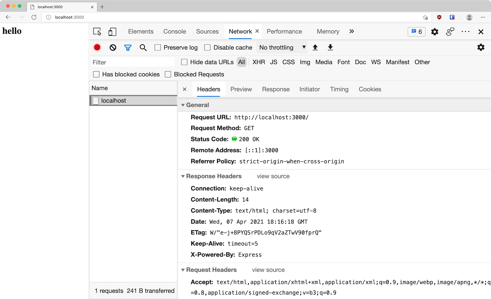
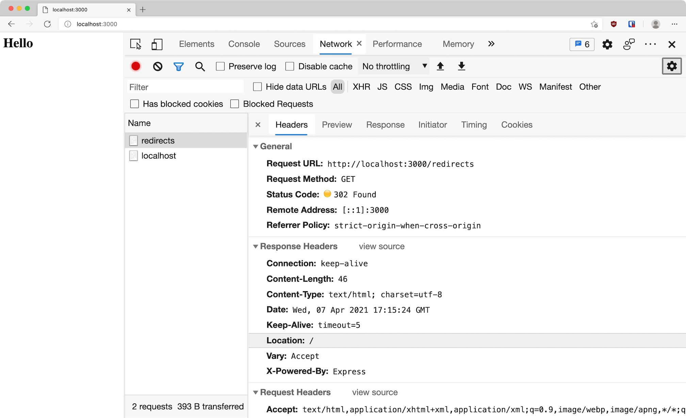

Node is often used to create HTTP servers for the web. It's a bit fiddly to do this with just the built-in modules, so we're going to use the Express library to help create our server.

## HTTP recap

HyperText Transfer Protocol (HTTP) is a way for computers to exchange messages over the internet. The "client" computer will send a "request" (often via a web browser). E.g. if you visit https://google.com your browser sends a request like this:

```
GET / HTTP/1.1
host: google.com
accept: text/html
```

A "server" computer receives this request and sends a "response". E.g. Google's server would send a response like this:

```
HTTP/1.1 200 Ok
content-type: text/html

<!doctype html>
<html><body><h1>Welcome to Google</h1>...</body></html>
```

We're going to learn how to use Node to create an HTTP server that can respond to requests.

## Workshop prep

1. Create a new directory
1. Move into that directory
1. Initialise the project to create a `package.json`
1. Install the Express library
1. Open your editor and create a `server.js` file

```shell
mkdir node-server-intro
cd node-server-intro
npm init -y
npm install express
code .
```

Follow along with each example in your own editor.

## Creating a server

We can create a new server object using the `express` module:

```js
const express = require("express");

const server = express();
```

## Handling requests

Our server currently does nothing. We need to add a "route". This is a function that will be run whenever the server receives a request to a specific path.

The `server` object has methods representing all the HTTP verbs (`GET`, `POST` etc). These methods take two arguments: the path to match and a handler function.

```js
const express = require("express");

const server = express();

server.get("/", (request, response) => {
  response.send("hello");
});
```

Here we tell the server to call our function for any HTTP GET requests to our home path.

The handler function will be passed two arguments: an object representing the incoming request, and an object representing the response that will eventually be sent.

We can use the `send` method of the response object to tell Express to send the response. Whatever argument we pass will be sent as the response body.

## Starting the server

Our Node program has a functioning server, but that server isn't currently listening for requests. Servers need to connect to the internet and listen for incoming HTTP requests on via a "port".



A "port" is an entry/exit point on a computer to allow network connections (like an airport allows people in/out of a country). HTTP uses port 80 by default (and HTTPS uses 443), so you don't normally see them in URLs on the web. E.g. when you visit `https://google.com` you are really going to `https://google.com:443`.

When you're running a server locally in development it's common to use a random number like 3000 or 8080. You can access a port by adding it to a URL like this: `http://localhost:3000`.



We can tell our server to listen on a port like this:

```js
const express = require("express");

const server = express();

server.get("/", (request, response) => {
  response.send("hello");
});

const PORT = 3000;

server.listen(PORT, () => console.log(`Listening on http://localhost:${PORT}`));
```

We use the `listen` method of the server object. This takes the port number to listen on, and an optional callback to run when it starts listening. This callback is a good place to log something so you know the server has started.

Now we can run the program in our terminal:

```shell
node server.js
```

The server will start and you should see "Server listening on http://localhost:3000" logged.



**Important**: The Node process will continue running until you tell it to stop by typing <kbd>control</kbd> + <kbd>c</kbd> in your terminal. Every time you change your code you must stop the old process and start a new one by running `node server.js` again.



## Sending requests

Open http://localhost:3000 in your browser. This will send a `GET` request to your server. You should see the "hello" response on the page. It's helpful to open the network tab of the dev tools so you can see all the details of the request and response.

<figure>
   
   <figcaption>The request in action</figcaption>
</figure>

## The response

HTTP responses need a few different things:

1. A status code (e.g. `200` for success or `404` for not found)
1. Headers to provide info about the response
1. A body (the response data itself)

### Status code

We're currently only providing the body. Express will set the status code to `200` by default. To set a different code use the `response.status` method:

```js
server.get("/", (request, response) => {
  response.status(404);
  response.send("hello");
});
```

You can chain this together with `send` to make it shorter:

```js
response.status(404).send("hello");
```

### Headers

Express will automatically set some headers describing the response. For example since we called `send` with a string it will set the `content-type` to `text/html` and the `content-length` to the size of the string.

You can set your own headers using the `response.set` method. This can take two strings to set a single header:

```js
response.set("x-fake-header", "my-value");
```

Or it can take an object of string values to set multiple headers:

```js
response.set({
  "x-fake-header": "my value",
  "x-another-header": "another value",
});
```

### HTML body

We aren't limited to plaintext in our body. The browser will parse any HTML tags and render them on the page. Change your handler to return some HTML instead:

```js
server.get("/", (request, response) => {
  response.send("<h1>Hello</h1>");
});
```

Visit http://localhost:3000 again and you should see an `h1` rendered.

Since we're rendering HTML using strings we can insert dynamic values using template literals. Let's add the current time to the response:

```js
server.get("/", (request, response) => {
  const time = new Date().toLocaleTimeString();
  response.send(`<h1>Hello, it's ${time}</h1>`);
});
```

### JSON body

We aren't limited to a text response. Lets send some JSON as well. Add a new route to your server:

```js
server.get("/json", (request, response) => {
  response.send({ message: "Hello" });
});
```

HTTP response bodies are always strings, so Express will automatically convert our object to a JSON string for us. It will also set the `content-type` header to `application/json`.

Visit http://localhost:3000/json and you should see a JSON object with a `message` property.

### Redirects

Sometimes we want to _redirect_ the request to another URL. You can use the `response.redirect` method for this. Add a new route:

```js
server.get("/redirects", (request, response) => {
  response.redirect("/");
});
```

Now if you visit http://localhost:3000/redirects in your browser you should end up back on the home page. If you look at the network tab in the dev tools you'll see two requests.

<figure>
   
   <figcaption>The redirect in action</figcaption>
</figure>

First a request to `/redirects`. This has a response status code of `302` and a `location` header pointing to `/`. This tells the browser to then make a second request to `/`.

## Dynamic route paths

Sometimes you can't know in advance all the routes you need. For example if you wanted a page for each user profile: `/users/oli`, `/users/dan` etc. You can't statically list _every_ possible route here. Instead you can use a placeholder value in the path to indicate that part of it is variable:

```js
server.get("/users/:name", (request, response) => {
  const name = request.params.name;
  response.send(`<h1>Hello ${name}</h1>`);
});
```

We use a colon (`:`) to indicate to Express that _any_ value can match a part of the path. It will put any matched values on the `request.params` object so you can use them.

If you visit http://localhost:3000/users/oli you should see "Hello oli". If you visit http://localhost:3000/users/knadkmnaf you should see "Hello knadkmnaf".

## Missing routes

Try visiting http://localhost:3000/not-real in your browser. You should see `Cannot GET /not-real`. This is Express' default response for when no handler matches a path.

You can customise this by putting a "catch-all" handler after all your other routes. If no other route matches then this will be used (since Express matches them in the order they are defined).

We can use the `server.use` method to create a handler that will match _any_ method/route:

```js
server.use((request, response) => {
  response.status(404).send("<h1>Not found</h1>");
});
```

Reload http://localhost:3000/not-real and you should now see your custom response.

## Middleware

Express route handlers don't have to send a response. They actually receive a third argument: the `next` function. Calling this function tells Express to move on to the next handler registered for the route.

Let's add another handler for the home route. It will just log the request, then move on to the next handler:

```js
server.get("/", (request, response, next) => {
  console.log(request.method + " " + request.url);
  next();
});

server.get("/", (request, response) => {
  response.send("<h1>Hello</h1>");
});
```

If you run this code and refresh the home page you should see `GET /` logged in your terminal.

The route methods accept multiple handler functions, so you can actually pass them all in one go. This does the same thing:

```js
function logger(request, response, next) {
  console.log(request.method + " " + request.url);
  next();
}

server.get("/", logger, (request, response) => {
  response.send("<h1>Hello</h1>");
});
```

Express calls handlers that don't send a response "middleware". Our example here isn't that useful, but we could change it to run before _all_ requests. We can do this with `server.use`:

```js
server.use(logger);
```

Now we'll get a helpful log like `GET /` in our terminal when we load any page. Without middleware we would have to copy this into every route we wrote.

## Static files

It's common to have some static files that don't change for each request. E.g. CSS, images, maybe some basic HTML pages. For convenience Express includes a built-in middleware for serving a directory of files: `express.static`.

Create a new directory named `public`. This is where we'll keep all the files sent to the client. Create a `public/style.css` file with some example CSS.

Finally configure the middleware to serve this directory:

```js
const staticHandler = express.static("public");

server.use(staticHandler);
```

The server will now handle requests to http://localhost:3000/style.css and respond with the file contents. Note that there is no `public` in the final URL: Express serves the files from the root of the site.

## Post requests

So far we've only created `GET` handlers. Let's add a `POST` handler to see how we'd deal with forms submitting user data to our server:

```js
server.post("/submit", (request, response) => {
  console.log("posted");
  response.send("thanks for submitting");
});
```

We can't make a test `POST` request as easily in our browser, since that would require a form. Instead we can send a request from our terminal using the `curl` program.

Open a new terminal window/tab and run:

```shell
curl -X POST localhost:3000/submit
```

You should receive a response of "Thanks for submitting". You can add the `--verbose` flag to see the entire HTTP request/response. If you check the terminal where your server is running you should see "posted" logged.

### Request body

A `POST` request that doesn't send any data isn't very useful. Usually a form would be submitting some user input. We can add data to our `curl` request with the `-d` flag:

```shell
curl -X POST localhost:3000/submit -d "name=oli"
```

However since bodies can be large they come in lots of small chunks. This means there's no simple way to just access the body. Instead we must use a "body parser" middleware.

For convenience these are included as part of the Express module. Request bodies can come in different formats (JSON, form etc), so we must use the right middleware. We want `express.urlencoded`, which is what forms submit by default. This is a function we call to create our middleware:

```js
const bodyParser = express.urlencoded();

server.post("/submit", bodyParser, (request, response) => {
  console.log(request.body);
  response.send("thanks for submitting");
});
```

This middleware will wait until all the submitted data has been received, then add a `body` property to the `request` object. We can then read this property in our handler.

If you use `curl` to send another `POST` request you should see something like `{ name: 'oli' }` logged in your server terminal.

---

That's it, you've learnt the basics of using Node and Express to create an HTTP server.
