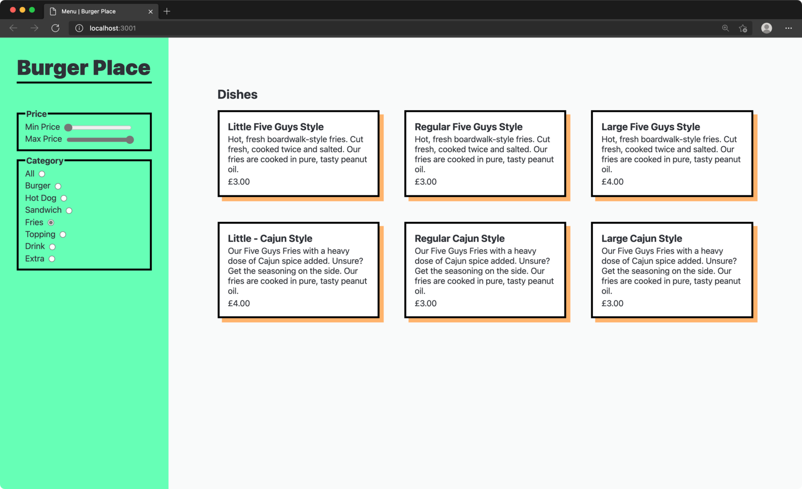
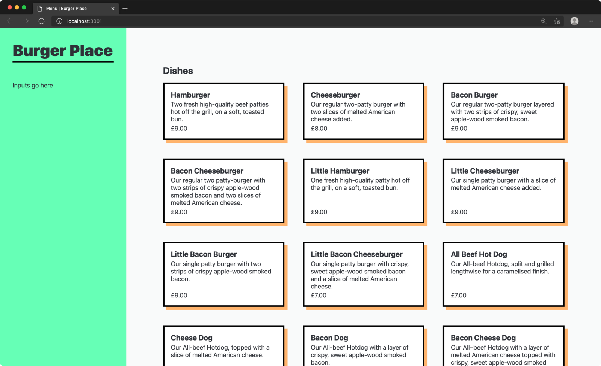
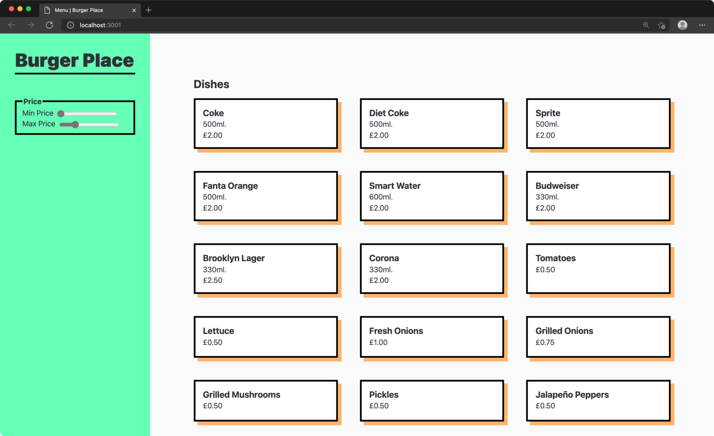
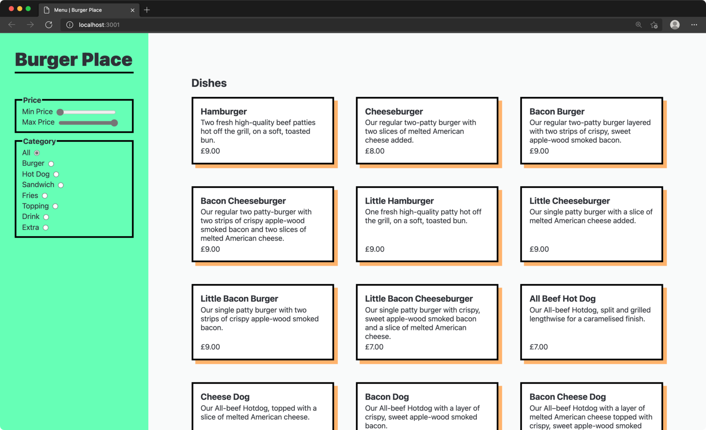

We're going to build a simplified food delivery menu page. It'll have a list of dishes plus a form to filter them. The final result should look something like this:



Don't worry, we'll work our way there step by step.

## Part 1: Project setup

1. Download starter files and `cd` in
1. Run `npm install`
1. Run `npm run dev` to start the dev server


Since React uses non-standard syntax (JSX) it requires some processing before it can run in the browser. We'll use [Vite](https://vitejs.dev/) for this. Vite also provides a nice dev server that will auto-reload when you change files.



Since JSX is non-standard JavaScript Vite requires you to use the `.jsx` extension for any files including that syntax.



Open `workshop/index.jsx` in your editor. This is where we render our React app to the DOM. You can see that we have a top-level component named `App`. Open `App.jsx` to see what's currently being rendered.

## Part 2: Render a list

JSX supports multiple child elements like this:

```jsx
function App() {
  return (
    <ul>
      <li>Apple</li>
      <li>Orange</li>
      <li>Banana</li>
    </ul>
  );
}
```

This is the same as listing those child elements in an array, like this:

```jsx
function App() {
  return <ul>{[<li>Apple</li>, <li>Orange</li>, <li>Banana</li>]}</ul>;
}
```

This isn't very ergonomic to write by hand, but it comes in handy when you need to render a dynamic list. We can generate an array from some data and render it:

```jsx
function App() {
  const fruits = ["Apple", "Orange", "Banana"];
  const fruitList = fruits.map((fruit) => <li key={fruit}>{fruit}</li>);
  return <ul>{fruitList}</ul>;
}
```

It's common to inline the `.map()` (although using a separate named variable is fine if you find it clearer):

```jsx
function App() {
  const fruits = ["Apple", "Orange", "Banana"];
  return (
    <ul>
      {fruits.map((fruit) => (
        <li key={fruit}>{fruit}</li>
      ))}
    </ul>
  );
}
```

We're passing a special prop called `key` to the top-level element in our array. This allows React to keep track of where each element is so it doesn't mess up the order. `key` should be unique and not change when the array order does. React will warn you if you forget this.

### Task

Uncomment the line importing `"../data.js"`. This is an array of objects, each representing a dish in our restaurant. Use `.map` to render all of them to the page inside the `ul`.

Take a look at what data you have available for each dish and try to render it all. You should end up with something like this:





```jsx
<ul className="grid">
  {dishes.map((dish) => (
    <li key={dish.id} className="card">
      <h3>{dish.name}</h3>
      <p>{dish.description}</p>
      <div>£{dish.price.toFixed(2)}</div>
    </li>
  ))}
</ul>
```



## Part 3: Create price inputs

We want to be able to filter the list of dishes by minimum and maximum price. To do this we'll need to create two [range inputs](https://developer.mozilla.org/en-US/docs/Web/HTML/Element/input/range).

It can be a good idea to group and label related elements using the [fieldset](https://developer.mozilla.org/en-US/docs/Web/HTML/Element/fieldset) element.

```jsx
<fieldset>
  <legend>Price</legend>
  <label htmlFor="min-price">
    Min price
    <input type="range" id="min-price" min="0.5" max="9" step="0.25" />
  </label>
  // ...
</fieldset>
```

Range inputs support constraining their values with the min/max/step attributes.

If we want these inputs to filter the list of dishes we'll need some state they can both use. For example we can create a state value called `min` that we update whenever the range input changes. Later we will be able to use the same `min` value to filter the dishes. By sharing the state value they'll always be in-sync.

```jsx
function App() {
  const [min, setMin] = React.useState(0);
  return (
    // ...
    <fieldset>
      <legend>Price</legend>
      <label htmlFor="min-price">
        Min price
        <input
          type="range"
          id="min-price"
          min="0.5"
          max="9"
          step="0.25"
          value={min}
          onChange={(event) => setMin(event.target.value)}
        />
      </label>
      // ...
  );
}
```



An input with both the `value` and `onChange` props set like this is called a ["controlled component"](https://reactjs.org/docs/forms.html#controlled-components). Our JS state is the source of truth, not the DOM element. Each time the user changes the input on the page we update our state, then that state updates the value of the input.



Add the second range input for the maximum price. You'll need another state variable to control the input's value.

You should end up with something like this:




```jsx
function App() {
  const [min, setMin] = React.useState(0);
  const [max, setMax] = React.useState(9);
  return (
    // ...
    <fieldset>
      <legend>Price</legend>
      <label htmlFor="min-price">
        Min price
        <input
          type="range"
          id="min-price"
          min="0.5"
          max="9"
          step="0.25"
          value={min}
          onChange={(event) => setMin(event.target.value)}
        />
      </label>
      <label htmlFor="max-price">
        Max price
        <input
          type="range"
          id="max-price"
          min="0.5"
          max="9"
          step="0.25"
          value={max}
          onChange={(event) => setMax(event.target.value)}
        />
      </label>
    </fieldset>
    // ...
  );
}
```



## Part 4: Filter list by price

Now we need to filter our dish list based on the price state.



**Hint:** remember our list is a normal JavaScript array. You can manipulate it using any of the array methods you're used to.



You should have something like this:





```jsx
<ul className="grid">
  {dishes
    .filter((dish) => dish.price >= min && dish.price <= max)
    .map((dish) => (
      <li key={dish.id} className="card">
        <h3>{dish.name}</h3>
        {dish.description && <p>{dish.description}</p>}
        <div>£{dish.price.toFixed(2)}</div>
      </li>
    ))}
</ul>
```



## Part 5: Modularise your components

Our `App` component is starting to get a bit unwieldy. We've got a single function containing all our state, plus two totally separate sections of the page. Let's try splitting it up into a couple of smaller components.

Create two new files: `DishList.jsx` and `PriceFilter.jsx`. `DishList.jsx` should contain the `<ul>` of dishes; `PriceFilter.jsx` should contain the `fieldset` with the range inputs.

Remember these components need to _share_ the same state. This means we can't define it down in each child component—the state needs to live in their shared parent (`App`) and be passed down to each child via props.



You might want to review the section on [setting props](/workshops/react-components#customising-components/) from the earlier workshop.





```jsx
// App.jsx

import React from "react";
import PriceFilter from "./components/PriceFilter";
import DishList from "./components/DishList";

function App() {
  const [min, setMin] = React.useState(0);
  const [max, setMax] = React.useState(9);
  return (
    <main>
      <section className="filters">
        <h1>Burger Place</h1>
        <form>
          <PriceFilter min={min} setMin={setMin} max={max} setMax={setMax} />
        </form>
      </section>
      <section className="dishes">
        <h2>Dishes</h2>
        <DishList min={min} max={max} />
      </section>
    </main>
  );
}

export default App;
```

```jsx
// DishList.jsx
import React from "react";

function DishList(props) {
  return (
    <ul className="grid">
      {dishes
        .filter((dish) => dish.price >= props.min && dish.price <= props.max)
        .map((dish) => (
          <li key={dish.id} className="card">
            <h3>{dish.name}</h3>
            {dish.description && <p>{dish.description}</p>}
            <div>£{dish.price.toFixed(2)}</div>
          </li>
        ))}
    </ul>
  );
}

export default DishList;
```

```jsx
// PriceFilter.jsx
import React from "react";

function PriceFilter(props) {
  return (
    <fieldset>
      <legend>Price</legend>
      <label htmlFor="min-price">
        Min price
        <input
          type="range"
          id="min-price"
          min="0.5"
          max="9"
          step="0.25"
          value={props.min}
          onChange={(event) => props.setMin(event.target.value)}
        />
      </label>
      <label htmlFor="max-price">
        Max price
        <input
          type="range"
          id="max-price"
          min="0.5"
          max="9"
          step="0.25"
          value={props.max}
          onChange={(event) => props.setMax(event.target.value)}
        />
      </label>
    </fieldset>
  );
}

export default PriceFilter;
```



## Part 6: Create radio group

We also want to filter our dishes by category. This is a good use-case for a group of radio inputs, since the categories are mutually exclusive.

Create a new file called `CategoryFilter.jsx` and make a new component in it. We need a radio input for each category.

You'll also need to create a state value to keep track of which radio is selected. Since this state will be needed to filter the `DishList` component it will need to live in their shared parent (`App`) and be passed down as a prop (just like the min/max state).

You can use the `checked` prop to determine which radio should be checked, based on the current state value. Here's an example:

```jsx
<label htmlFor="burger">
  Burger
  <input
    type="radio"
    name="categories"
    id="burger"
    value="burger"
    checked={someStateVar === "burger"}
    onChange={(event) => setSomeStateVar(event.target.value)}
  />
</label>
```

You should end up with something like this:





```jsx
// App.js

// ...

function App() {
  // ...
  const [category, setCategory] = React.useState("burger");
  return (
    // ...
    <CategoryFilter category={category} setCategory={setCategory} />
    // ...
  );
}
```

```jsx
// CategoryFilter.jsx

function CategoryFilter(props) {
  return (
    <fieldset>
      <legend>Categories</legend>
      <label htmlFor="burger">
        Burger
        <input
          type="radio"
          name="categories"
          id="burger"
          value="burger"
          checked={props.category === "burger"}
          onChange={(event) => props.setCategory(event.target.value)}
        />
      </label>
      // ... all the other radios
    </fieldset>
  );
}

export default CategoryFilter;
```



## Part 7: Filter list by category

Now we need to filter our list by category as well as the existing price filters. Use your category state value to filter the array in `DishList`. Make sure you keep the price filter working.

If everything is hooked up correctly you should see something like this 🎉




```jsx
// App.js

// ...

function App() {
  // ...
  const [category, setCategory] = React.useState("burger");
  return (
    // ...
    <DishList min={min} max={max} category={category} />
    // ...
  );
}
```

```jsx
<ul className="grid">
  {dishes
    .filter((dish) => dish.category === props.category)
    .filter((dish) => dish.price >= props.min && dish.props.price <= max)
    .map((dish) => {
      // ...
    })}
</ul>
```



## Stretch goals

1. Add a default "All" option to the category filter
1. Add a text input that lets users search for dishes by title
1. Make it look even better 💅
