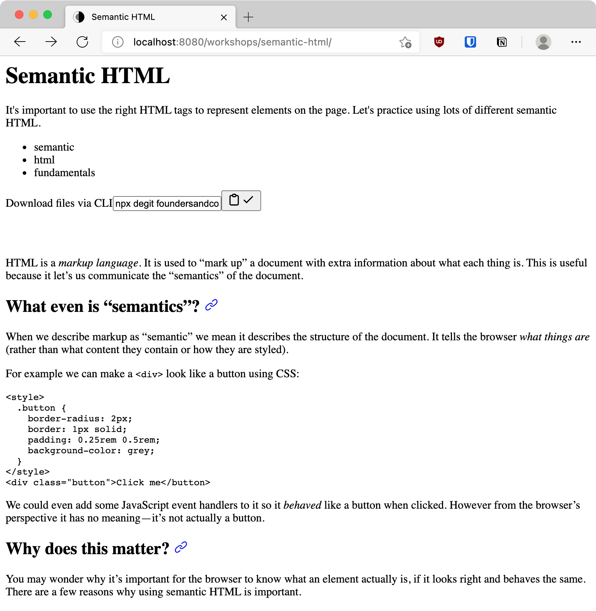

HTML is a _markup language_. It is used to "mark up" a document with extra information about what each thing is. This is useful because it let's us communicate the "semantics" of the document.

## What even is "semantics"?

When we describe markup as "semantic" we mean it describes the structure of the document. It tells the browser _what things are_ (rather than what content they contain or how they are styled).

For example we can make a `<span>` look like a button using CSS:

```html
<style>
  .button {
    border-radius: 2px;
    border: 1px solid;
    padding: 0.25rem 0.5rem;
    background-color: grey;
  }
</style>
<span class="button">Click me</span>
```

We could even add some JavaScript event handlers to it so it _behaved_ like a button when clicked. However from the browser's perspective it has no meaning—it's not actually a button.

## Why does this matter?

You may wonder why it's important for the browser to know what an element actually is, if it looks right and behaves the same. There are a few reasons why using semantic HTML is important.

### Sensible defaults

Browsers have a bunch of built-in styles and behaviours you should take advantage of. Why re-create all of that from scratch when you could just override the bits you want to change.

This also means your page will still look okay if your CSS is broken or fails to load.

<figure>
  
  <figcaption>Screenshot of this page with no CSS at all</figcaption>
</figure>

### Complex behaviour

You probably won't remember to reproduce _everything_ the browser does for you. For example buttons not only respond when clicked, but also when the "Enter" or "Space" keys are pressed. Built-in elements have lots of complex behaviours that are hard (or impossible) to reproduce. Think how complicated a `<select>` would be to build yourself!

### Machine-readable

Third (and most importantly) semantic HTML is _machine readable_. By describing the structure of our page we allow computer programs to understand it as well as humans.

For example most web browsers now have a "reader" mode. You can click an icon to get a simplified view of an article (with all the ads, cookie banners etc removed). These rely on the article using elements like `<header>` and `<article>`to know what bits to keep. They can also apply custom styles to make it easier to read. If everything was in a div with custom CSS this wouldn't work.

This article about [building for Safari Reader Mode](https://medium.com/@mandy.michael/building-websites-for-safari-reader-mode-and-other-reading-apps-1562913c86c9) is a great overview of this topic if you're interested.

This is also very important for _accessibility_. The web is for everyone, including people who use other types of software to browse. For example visually-impaired users often use "screen readers", which read the page out loud.

Screen readers rely on semantics, otherwise everything just looks like a div to them. For example using heading tags (`<h1>`, `<h2>` etc) creates a page structure that lets a user quickly jump from section to section to find what they need (without waiting for the entire page to be read out loud).

<figure>
  
  <figcaption>Screenshot of Voiceover's headings menu for this page</figcaption>
</figure>

This allows a visually-impaired user to get a quick overview of the structure of the page in the same was a sighted user does by scanning the headings.

## So how do we make our HTML semantic?

There are almost 100 HTML elements nowadays, but you don't need to remember them all. The important thing is to remember that there might be a more specific tag than div or span for what you're making.

This especially applies to top-level "blocks" of the page. Fun fact: when HTML5 was in-progress the spec authors looked at thousands of existing websites to see what the most popular IDs on top-level elements were. They saw a ton of `<div id="header">`, `<div id="main">` and `<div id="footer">`, which is why HTML5 added the `<header>`, `<main>` and `<footer>` tags.

### Checklist

Here's a quick list to run through whenever you're picking an element:

- **Is it a meaningful area of the page?**  
  Use an HTML5 block element like `<header>` or `<footer>`.
- **Does it label the start of a new section?**  
  Use a heading (with the right level) like `<h2>` or `<h3>`
- **Does it navigate to a new page?**  
  Use an `<a href="/page">`
- **Does it trigger JS behaviour?**  
  Use a `<button>`
- **Does it allow user input?**  
  Use a `<form>` containing `<input>`s (with `<label>`s!)
- **Is it just for applying some layout/styles?**  
  Use something like `<div class="grid">` or `<span class="big-text">`

## Challenge

You're going to re-write an HTML page to use semantic HTML. Try to replace as many generic elements with more descriptive semantic ones as you can. When you're done it should contain no `<div>`s at all.

### Setup

First you need to download the starter files. There's a box at the top of this page labelled "Download files via CLI". Click the copy button to copy the command, then run it in your Terminal. This will automatically download the files you need for this workshop.

Once you've downloaded the files you can move into that directory in your Terminal by running:

```shell
cd semantic-html
```

You can see what's in there by listing the files with:

```shell
ls
```

You can open the challenge file in VS Code with:

```shell
code challenge.html
```

And you can open the page in your default browser with:

```shell
open challenge.html
```

You are of course welcome to navigate the files however you're comfortable, but it's a good idea to get some practice working in your Terminal.

Don't peek at the solution before you try the challenge!

### Bonus challenge

There are a few missing things that aren't necessarily related to _semantics_, but are important for the page to have anyway. Try to find and fix some of these issues.

There's some useful info in [this article on how web pages are structured](https://oliverjam.es/blog/complete-guide-to-making-web-pages/).
